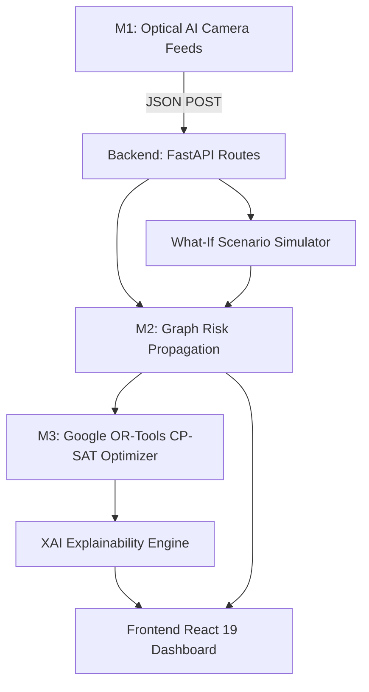

# 🚦 NAGPUR-R2: Tactical Urban Traffic Risk & Police Dispatch Intelligence

**NAGPUR-R2** is a real-time smart city traffic command & control platform that combines **live optical AI camera telemetry**, **graph-based traffic risk propagation (M2)**, and **Google OR-Tools CP-SAT constrained police unit dispatch optimization (M3)** with **Explainable AI (XAI)** decision intelligence.

Designed for Nagpur Smart City's key arterial corridors (Wardha Rd, Zero Mile, Sitabuldi, Mahal, Laxmi Nagar, Manewada), NAGPUR-R2 predicts downstream gridlock shockwaves **15 minutes before they happen** and computes mathematically optimal police interceptor dispatches to neutralize unmanaged risk shadows.

---

## 📁 Repository Structure

```
NAGPUR-R2/
├── backend/                  # FastAPI Application Layer
│   ├── api/                  # Route Controllers (Risk, Deploy, Sim, XAI, Camera)
│   ├── services/             # Core Service Orchestrators
│   ├── config.py             # Central Environment Settings
│   └── main.py               # FastAPI Entrypoint & Lifespan
├── modules/                  # Core Algorithmic & AI Engines
│   ├── m1_risk_prediction/   # Computer Vision & Telemetry Ingestion
│   ├── m2_risk_propagation/  # Graph Shockwave Propagation & Risk Shadows
│   ├── m3_police_deployment/ # Google OR-Tools CP-SAT Dispatch Optimizer
│   └── xai/                  # Explainability & Decision Audit Engine
├── frontend/                 # React 19 + Vite + Leaflet + Tailwind Dashboard
│   ├── src/                  # Components, Hooks, GIS Map, Services
│   ├── public/videos/        # Optimized Camera Stream Assets
│   ├── package.json          # Node Dependencies & Build Scripts
│   └── vite.config.ts        # Vite Bundler Configuration
├── simulations/              # What-If Scenario Definitions (Festival, Rain, Accident)
├── data/                     # Baseline GIS & Road Graph Datasets
├── docs/                     # Technical Specifications & Architecture Docs
├── requirements.txt          # Python Dependencies
├── .env.example              # Backend Environment Template
└── README.md
```

---

## ⚡ Quickstart (Local Development)

### 1. Backend Server (FastAPI)
Requires Python 3.10+.

```bash
# Navigate to project root
cd NAGPUR-R2

# Create and activate virtual environment
python -m venv venv
# Windows:
venv\Scripts\activate
# Linux/macOS:
source venv/bin/activate

# Install dependencies
pip install -r requirements.txt

# Start backend server
uvicorn backend.main:app --reload --port 8000
```
* Backend API: `http://localhost:8000`
* Interactive API Docs (Swagger): `http://localhost:8000/docs`

---

### 2. Frontend Dashboard (React + Vite)
Requires Node.js 18+.

```bash
# In a second terminal
cd NAGPUR-R2/frontend

# Install dependencies
npm install

# Start development server
npm run dev
```
* Dashboard URL: `http://localhost:3000` (or `http://localhost:5173`)

---

## ☁️ Deployment Guide

### Deploy Backend (e.g. Render / Railway / Cloud Run)
* **Build Command**: `pip install -r requirements.txt`
* **Start Command**: `uvicorn backend.main:app --host 0.0.0.0 --port $PORT`
* **Environment Variables**:
  * `HOST`: `0.0.0.0`
  * `CORS_ORIGINS`: `*` (or your frontend domain)

### Deploy Frontend (e.g. Vercel / Netlify / Cloudflare Pages)
* **Root Directory**: `frontend`
* **Build Command**: `npm run build`
* **Output Directory**: `dist`
* **Environment Variables**:
  * `VITE_API_URL`: `https://your-backend-api.onrender.com` (your deployed backend URL)

---

## 🏗️ Architecture



